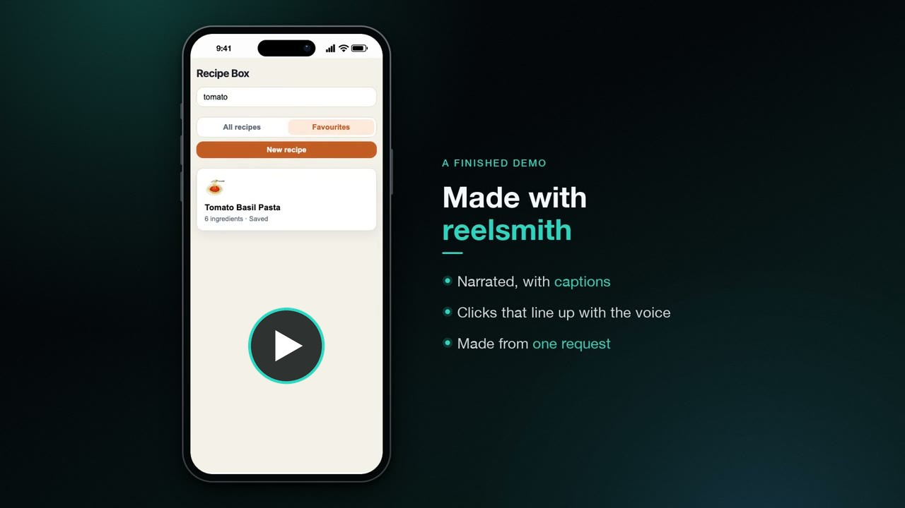

# reelsmith

[](https://github.com/mz-real/reelsmith/actions/workflows/ci.yml)

Narrated product demos, made on your own machine and checked before you share them.

You ask your AI coding tool for a demo. It interviews you, writes a plan and drives the `reelsmith` CLI: it records the app, voices the script with a local model, renders slides, puts it all together, then checks the finished video. You approve the plan and the words before anything is voiced or rendered. Nothing is uploaded.

https://github.com/user-attachments/assets/f8cad838-b6bf-4ef9-8fef-a250751d1a61

[](https://youtu.be/HNfxU_n8eVc)

Both videos were made with reelsmith itself. The full walkthrough has chapters and captions.

> **Status:** reelsmith 0.1.0 is not released yet. It is not on PyPI and the plugin is not in a published release. You can try it from source today (see [Install](#install)).

## Who it is for

- Developers and small product teams who ship features faster than they can record demos for them.
- Developer advocates and technical writers who keep walkthroughs and release videos up to date.
- Founders and indie makers who need a clear product video without a studio, a voice actor or an online voice service.
- Anyone who already has a screen recording and wants it explained.

It is not a general video editor. It is for demos that follow a product: the clicks, the screens and the reasons behind them.

## Start with Narrate

The quickest win is a recording you already have. reelsmith finds every change on screen, the AI writes a script pinned to those moments, you approve it, and you get the same video back with a voice that explains each click, plus captions.

```
reelsmith init demo --preset narrate
reelsmith capture import ~/Movies/invoice.mov demo --id main
reelsmith detect demo --clip main
# the AI marks events in clip.json and writes script.yaml, you approve it
reelsmith run demo
```

The length stays the same unless you allow held frames or sped up waits. Narrate needs no browser automation and no mobile tools, and `reelsmith doctor` only checks what it uses: Python, ffmpeg and the voice models.

When you want the full package, Produce adds slides, browser and phone frames, and several formats (see [Two modes](#two-modes)).

## Checked before you share it

Making a demo video is the easy part. Making one you can trust is harder: a dropped word, a voice that runs ahead of the click, a caption too quick to read, or a blurred email that shows for one frame. reelsmith checks the finished video every time, and the AI clears every failure before it calls the video done.

| Check | Catches |
|---|---|
| Transcript vs script | missing, slurred or changed words |
| Sync | phrases early or late against their click |
| Cut off lines | narration running into the next scene or past the end |
| End of line noise | clicks or breaths after the last word |
| Loudness | far from -16 LUFS, or clipping |
| Hold limits | frozen frames longer than allowed |
| Captions | text overflowing its panel, or on screen too briefly to read |
| Blur | listed regions covered on every frame they apply to |
| Contact sheets | frames at each scene start, event and transition, to look at |

Each line is also checked as it is voiced: the pace must stay between 130 and 210 words a minute, and a local Whisper model reads it back and compares it word by word with the script. `reelsmith qa` writes `qa/report.md` with what failed and how to fix it.

These checks caught real problems while reelsmith was being built, such as a click pinned more than a second late and last syllables cut from lines. Both are fixed and covered by tests.

## Why it exists

Demo videos take a long time to make by hand: record, write a script, read it out, cut it to the clicks, add captions, export three sizes. Online voice tools want your audio and your money. reelsmith does the whole job locally with open models, and the AI tool you already use runs it for you.

The AI never writes video code. It follows shared instructions and calls one CLI, so the results are the same in Claude Code, Codex, Cursor, Gemini CLI and Copilot.

## Quick start

### Claude Code

```
/plugin marketplace add mz-real/reelsmith
/plugin install reelsmith@reelsmith
```

Then ask: "make a demo of my app". The skill checks for the CLI and offers to install it if it is missing.

### Codex, Cursor, Gemini CLI, Copilot

Install the CLI (see [Install](#install)), then write the instruction files into your project:

```
reelsmith agent install codex      # AGENTS.md
reelsmith agent install cursor     # .cursor/rules/reelsmith.mdc
reelsmith agent install gemini     # GEMINI.md
reelsmith agent install copilot    # .github/copilot-instructions.md
```

The step guides go into `reelsmith-guides/` next to them. Use `--project <path>` to write into a folder other than the current one.

### Any other tool

Paste [`prompts/HANDOVER_PROMPT.md`](prompts/HANDOVER_PROMPT.md) into the chat. It is short: the rules and the steps, with links to each guide. [`prompts/HANDOVER_PROMPT_FULL.md`](prompts/HANDOVER_PROMPT_FULL.md) has every guide in one file, for tools that cannot open links.

## Two modes

The first interview question picks the mode.

**Narrate.** You already have a recording and want a voice that explains each click. See [Start with Narrate](#start-with-narrate).

**Produce.** The full package: slides for the business logic, browser or phone frames, captions, tap ripples, transitions and several formats. The Recipe Box example is a ready made Produce demo:

```
reelsmith capture web examples/recipe-box/flows/search.py examples/recipe-box --id search
# ...one capture per flow, see examples/recipe-box/README.md
reelsmith run examples/recipe-box
```

`reelsmith run` goes from script check to export and stops at the first error. Add `--preview` for a fast draft with no export.

## What the interview asks

One question at a time, each with suggested answers. Presets skip most of them: `reelsmith init demo --preset quick|tour|mobile|release-notes|narrate` writes a valid starting spec, script and slides.

1. Narrate an existing recording, or produce a full demo?
2. What should it show? One feature, a full tour, the mobile app, release notes.
3. Who is watching, and how long? Team, customers or social, 30 s to 5 min.
4. Where does the footage come from? Your recordings, automated web, or automated mobile.
5. Which voice? A Kokoro stock voice, your own voice (Chatterbox), or silent with captions.
6. Format, branding, and anything on screen to blur.

The answers become `spec.yaml` (approval point 1). The narration becomes `script.yaml` (approval point 2).

## Install

You need [uv](https://docs.astral.sh/uv/) and ffmpeg 6 or newer. Python 3.11 to 3.13 is fine, and uv can install it for you.

Until 0.1.0 is on PyPI, install from source:

```
uv tool install git+https://github.com/mz-real/reelsmith
```

Once it is on PyPI this becomes `uv tool install reelsmith`.

Then set up the rest:

| Step | Windows | macOS | Linux |
|---|---|---|---|
| ffmpeg | `winget install ffmpeg` | `brew install ffmpeg` | `sudo apt install ffmpeg` or `sudo dnf install ffmpeg` |
| Browser for web capture and slides | `reelsmith setup browser` | same | same |
| Java 17 or newer (mobile only) | `winget install EclipseAdoptium.Temurin.17.JDK` | `brew install --cask temurin@17` | your distro's OpenJDK 17 package |
| Maestro (mobile only) | see the [Maestro docs](https://docs.maestro.dev/) | `curl -fsSL "https://get.maestro.mobile.dev" \| bash` | same as macOS |

Then check everything:

```
reelsmith doctor
```

doctor checks only what your demo needs. In a demo folder (or with `reelsmith doctor DIR`) it reads `spec.yaml` and picks a profile: web, mobile, narrate, voice or clone. A web demo is never asked for Java, Maestro or adb. `--profile all` checks the whole machine. It prints the fix for your OS, and `reelsmith doctor --fix` offers to run those fixes and asks before each one.

More detail per OS, including GPU notes for cloning: [docs/install.md](docs/install.md).

## Voices

**Kokoro stock voices (default).** Small, fast on a laptop CPU, no PyTorch. Good English voices:

| Voice | Accent |
|---|---|
| `af_heart` (default) | US female |
| `af_bella` | US female |
| `bf_emma` | UK female |
| `am_michael` | US male |
| `am_fenrir` | US male |
| `bm_george` | UK male |

Hear a few read the same line:

```
reelsmith voice preview --text "Type a dish into the search box." --voices af_heart,bf_emma,am_michael
```

**Your own voice (Chatterbox).** Optional, through the `clone` extra. It needs PyTorch and Python 3.11 or 3.12:

```
uv tool install --python 3.12 "reelsmith[clone] @ git+https://github.com/mz-real/reelsmith"
```

Once on PyPI: `uv tool install --python 3.12 "reelsmith[clone]"`.

The consent policy, stated plainly:

- Only clone your own voice, or a voice you have the speaker's permission to use.
- `spec.yaml` records that consent as `consent: own` or `consent: permission`. Without it, reelsmith refuses to clone.
- The Chatterbox watermark is always on. reelsmith will not run a build without it.
- Nothing is uploaded. Your sample and the generated audio stay on your machine.

Cloning is supported and covered by tests with stand ins. A real Chatterbox run is on the manual release checklist. More in [docs/voices.md](docs/voices.md).

## Commands

Most commands take the demo folder as an argument and default to the current folder. Every command ends with an `[OK]`, `[WARN]` or `[ERROR]` line and a `Next:` step. Add `--json` before the command (`reelsmith --json status`) to get that result as one JSON line. Progress for long steps goes to stderr.

| Command | What it does |
|---|---|
| `reelsmith doctor [DIR]` | Check the tools this demo needs. `--profile` to pick the set, `--fix` to install. |
| `reelsmith init <dir>` | Create a demo folder with starter spec, brand and script files. `--preset` for a ready start. |
| `reelsmith status` | Show which steps are done, stale or missing, and the next command. `--json` for agents. |
| `reelsmith capture import <video> --id <id>` | Normalise a recording into `capture/clips/<id>/`. |
| `reelsmith capture web <flow.py> --id <id>` | Record a Playwright flow. `--size`, `--headed`. |
| `reelsmith capture mobile <flow.yaml> --id <id> --platform ios\|android` | Record a Maestro flow. `--device` picks the simulator or device when more than one runs. |
| `reelsmith detect --clip <id>` | Find screen changes in a clip and write contact sheets. |
| `reelsmith script check` | Check that scenes match spec.yaml and pins name real clip events. |
| `reelsmith voice preview --text "..."` | Read one line in a few Kokoro voices. |
| `reelsmith voice generate` | Voice every line in script.yaml. `--only scene/line` to redo some. |
| `reelsmith voice pick-reference <recording>` | Find the cleanest stretch of a voice recording for cloning. |
| `reelsmith voice compare --refs a.wav,b.wav` | Read a few lines with each reference and recommend one. |
| `reelsmith slides` | Render slides from slides.yaml. |
| `reelsmith compose` | Render each scene and join them into `build/master_<format>.mp4`. `--preview` for a fast 540p draft. |
| `reelsmith qa` | Check the composed video and write `qa/report.md`. |
| `reelsmith export` | Write voiced and silent videos, the narration and an .srt to `out/`. |
| `reelsmith run` | Run every step from script check to export. `--preview` makes a fast draft and skips export. |
| `reelsmith agent install <tool>` | Write instruction files for claude, codex, cursor, gemini or copilot. |
| `reelsmith setup browser` | Install the Chromium build used for web capture and slides. |
| `reelsmith schema export` | Write the JSON Schemas of the file formats. |

Run any command with `--help` for all its options. File formats are described in [docs/formats.md](docs/formats.md).

## FAQ and troubleshooting

**`ffmpeg` not found, or doctor says it is too old.** Install ffmpeg 6 or newer with the command in the install table, then open a new terminal so the PATH updates. `reelsmith doctor` confirms it.

**The first voice run is slow.** The first `voice generate` downloads about 290 MB of models into your user cache: the Kokoro model (114 MB), its voices (28 MB) and the Whisper model that checks for dropped words (about 145 MB). Later runs use the cache.

**Paths on Windows.** Quote paths that contain spaces. In YAML files, use forward slashes (`C:/Users/me/ref.wav`) or single quotes. Inside double quotes a backslash starts an escape, so `"C:\new"` breaks. In PowerShell, set environment variables with `$env:NAME="value"`.

**Cloning is very slow.** Without an NVIDIA GPU or Apple Silicon, Chatterbox runs on the CPU and often takes a minute or more per line. reelsmith warns when it falls back to the CPU. Kokoro stays fast on any machine.

**Android capture stopped at 3 minutes.** `adb screenrecord` stops after 180 seconds, and reelsmith reports an error if a flow runs longer. Split the Maestro flow into several clips.

**iOS capture does not work.** iOS simulators need macOS with Xcode. Android capture works on all three systems with an emulator or a USB device with debugging on. Mobile capture is supported but needs Java, Maestro and a simulator or device. Real device runs are on the manual release checklist.

A command printed a Python traceback? That is a bug. Please [open an issue](https://github.com/mz-real/reelsmith/issues) with the command and its output.

## Licences and credits

reelsmith is MIT licensed. It stands on these projects:

| Dependency | Licence | How it is used |
|---|---|---|
| Kokoro (model and ONNX runtime) | Apache 2.0 | downloaded on first use, not bundled |
| Chatterbox | MIT | optional extra, downloaded on first use |
| espeak-ng (shipped by espeakng-loader, a kokoro-onnx dependency) | GPL 3.0 | separate library in its own package, loaded at run time, not part of our code |
| Whisper (faster-whisper) | MIT | local transcription |
| Playwright | Apache 2.0 | web capture and slide rendering |
| Maestro | Apache 2.0 | user installed, mobile automation |
| ffmpeg | LGPL or GPL depending on build | user installed |

Thanks to everyone who builds and maintains them.

## Contributing, security, licence

- [CONTRIBUTING.md](CONTRIBUTING.md): dev setup, checks and how to add a command.
- [SECURITY.md](SECURITY.md): how to report a vulnerability privately.
- [CODE_OF_CONDUCT.md](CODE_OF_CONDUCT.md)
- [CHANGELOG.md](CHANGELOG.md)
- [LICENSE](LICENSE): MIT.
